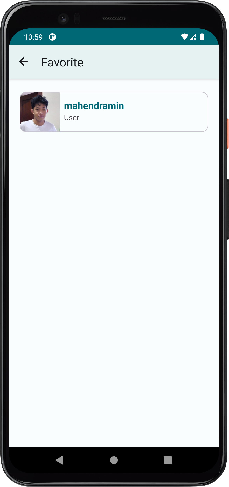

# GithubConnect
Submission of "Belajar Fundamental Aplikasi Android" course from Dicoding 

## Description
Final project of "Belajar Fundamental Aplikasi Android" course from Dicoding.
GithubConnect is an app that have several main features:
<ul>
  <li>Search GitHub user by username</li>
  <li>Get users detailed information such as user's name, following/followers list, where users work, current location, and total repository</li>
  <li>Save user in local database</li>
</ul>
and built with:
<ul>
  <li>Android Studio</li>
  <li>Navigation Component</li>
  <li>NavigationUI</li>
  <li>ViewModel</li>
  <li>LiveData</li>
  <li>Retrofit</li>
  <li>Room</li>
  <li>Preference DataStore</li>
  and so many on...
</ul>

## How to run the app
<ol>
  <li>Clone or download this repository and open it with Android Studio</li>
  <li>open <code>local.properties</code>, add <code>API_KEY</code> and fill the value with your own GitHub Token and <code>BASE_URL</code> with https://api.github.com/ value</li>
  <li>Rebuild Project</li>
</ol> 

## Features
<b>Home</b>
 

 
<b>Search Result</b>
 

 
<b>Detail</b>
 

 
<b>Favorite</b>
 

 
<b>Settings</b>
 

 
